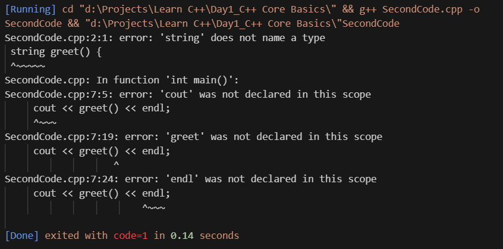
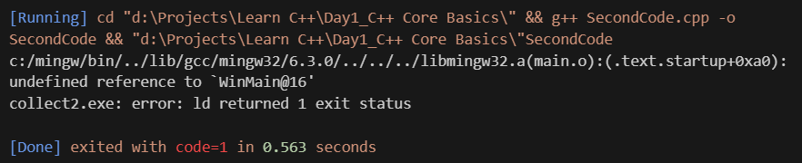
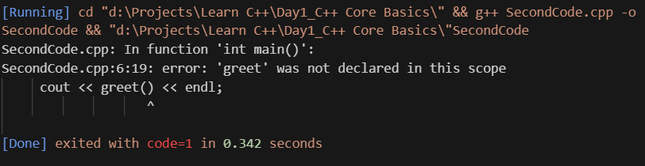
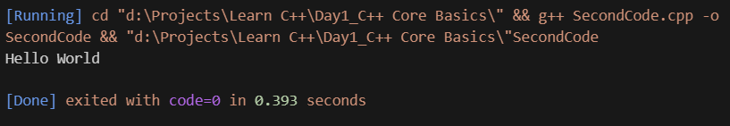

# 🧱 Opject Oriented Programming
is a way of writing computer programs that models things as objects [ex: Cat] each with:

- Attributes/Data [Properties of the cat] -> stored as variables [Color, Age, Name, etc.]
- Methods/Functions [Cat Behaviors] ->written as functions [Meow, Sleep, Eat, etc.]

## 🧰 4 Main Concepts in OOP:

### 1. Class

[🧾 recipe or **blueprint** to make a cat, not the cat itself]

<table>
    <tr><th>🐍python</th> <th>💻cpp</th></tr>
    <tr><td><pre>class Cat:
    def __init__(self, name, color):
        self.name = name
        self.color = color <br>
cdef meow(self):
        print("Meow"!)</pre></td>
    <td>
    <pre>#include <iostream>
using namespace std;<br>
class Cat {
public:
    string name;
    string color;<br>
void meaw() {
    cout << "Meow!" << endl;
    }
};</pre></td></tr>
</table>


### 2. Object

[🐈 The **Real Cat** made from the blueprint]

<table>
    <tr><th>🐍python</th> <th>💻cpp</th></tr>
    <tr>
        <td><pre>my_cat= Cat("Luna", "White")</pre></td>
        <td>
        <pre>int main(){<br>    Cat myCat;<br>    myCat.name = "Luna";<br>    myCat.color = "White";<br>    myCat.color = "White";<br>    return 0;<br>} </pre>
        </td>
</table>

now `my_cat` is a **real object** with name Luna and color White.

### 3. Encapsulation 

[📦 package all cat's info and behavior insicde cat object]

You can also **hide** data using `private`:
<table>
    <tr><th>🐍python</th> <th>💻cpp</th></tr>
    <tr>
        <td><pre>my_cat.meow()</pre></td>
        <td>
        <pre>class Cat{<br>private:<br>  string name;<br><br>public:<br>  void setName(string n) {<br>      name = n;<br>   }<br>   string getName() {<br>      return name;<br>    }<br>};</pre>
        </td>
    </tr>
</table>

you don't have to know how the behavior or property works internally works inside to use the cat

### 4. Inheritance
[ 👪 you can **Reuse the blueprint** based on others]

<table>
    <tr><th>🐍python</th> <th>💻cpp</th></tr>
    <tr>
        <td>
            <pre>class Tiger(Cat):<br>  def roar(self):<br>     print("ROAR!")
            </pre></td>
        <td>
        <pre>class Tiger :public Cat{<br>public:<br>    void roar(){<br>        cout << "ROAR!" &lt;&lt;endl; <br>    }<br>};</pre>
        <pre>int main() {<br>   Tiger t;<br>    t.roar();  // ROAR!<br>    t.meow();  // Meow (from Cat)<br>    return 0;<br>}</pre>
        </td>
</table>

Now `Tiger` has everything from `Cat`, and more.

### 5. Polymorphism
[🧙 One Command, Many Behaviors]

<table>
    <tr><th>🐍python</th> <th>💻cpp</th></tr>
    <tr>
        <td>
            <pre>cat.speak() #Meow!<br>dog.speak() #Woof!</pre>
        </td>
        <td>
            <pre>class Animal {<br>public:<br> virtual void speak(){<br>     cout << "Some sound" << endl;<br>   }<br>};<br><br>class Cat : public Animal {<br>public:<br>   void speak() override {<br>        cout << "Meow!" << endl;<br>    }<br>};<br><br>class Dog : public Animal {<br>public:<br>   void speak() override{<br>      cout << "Woof!" << endl;<br>    }<br>};</pre>
            <b>In Action</b>
            <pre>int main() {<br>   Animal* a1 = new Cat();<br>   Animal* a2 = new Dog();<br><br>   a1->speak(); // Meow!<br>   a2->speak(); // Woof!<br><br>   delete a1;<br>   delete a2;<br>   return 0;<br>}
</table>

# 🏷️ Variables
is like a labeled box in computer's memory. used to store data such as 
(numbers, words, characters, etc...)

## 🔹Declaration & Initialization

|Action         |Example        |Meaning                                                                    |
|---------------|---------------|---------------------------------------------------------------------------|
|Declaration    | `int age;`    |Tell the computer you need a variable called `age` that will store a number|
|Initialization |`int age = 30;`|Tell the computer to create `age` and give it the value `30` right away    |

## 🔤 Types of Variables

| Type     | Meaning                         | Example                                            |
| -------- | ------------------------------- | -----------------------                            |
| `int`    | Whole numbers (whole number)    | `int age =25;`                                     |
| `float`  | Decimal numbers (less precision)| `float temp = 36.5;`                               |
| `double` | Decimal numbers (more precision)| `double pi = 3.14159;`                             |
| `char`   | Single character                | `char grade = 'A';`                                |
| `string` | Text                            | `string name ='Luna';`(requirs `#include <string>`)|
| `bool`   | True or False                   | `bool isHappy = true;`                             |

## 🧠 Rules for Naming Variables
1. Must start with a **letter** or **underscore** (`_`)
2. No spaces or symbols (like `@`,`%`,etc)
3. Case-sensitive: `Age`!=`age`
4. Use meaningful name like `score `,`print`,`isloggedIn`

## 💡 What Can You Do With Variables?
✅ Declare them
✅ Assign values
✅ Read/change them
✅ Use them in calculations


### Example: Changing a Variable
in cpp
```cpp
int score= 18;
score = score + 5 // score becomes 15
```

#  💻 C++ Program
## 🧠 The Main Structure
### 📦 Loading the Libraries
Telling the compiler which tools or features we need to use (like input/output or string handling)

Example:
```cpp
#include <iostream>
#include <string>
using namespace std;
```

### ✍️ Giving Instructions and Definitions
This is where we define our own functions and explain what they should do.

Example:
```cpp
string greet() {
    return "Hello World";
}
```

### 🚀 Order When to Run
This is the `main()` function —— the entry point where the program begins executing.

Example:
```cpp
int main() {
    cout << greet() << endl;
    return 0;
}
```

### ⚙️ Final Step: Translation to Machine Code
The compiler takes everything above —— libraries, definitions, and the main entry point —— and converts it into machine code so the computer can run it.
## Some Examples
### 🟢 1. ✅ Full Example - Main Structure of a C++

The Program:
```cpp
#include <iostream>
#include <string>
using namespace std;

string greet() {
    return "Hello World";
}

int main() {
    cout << greet() << endl;
    return 0;
}
```
The Output:


**code=0**

### 🔴 2. ❌ Missing Library Includes

The Program:
```cpp
// Missing: #include <iostream> and #include <string>

using namespace std;

string greet() {
    return "Hello World";
}

int main() {
    cout << greet() << endl; // ❌ Error: 'cout' and 'string' not recognized
    return 0;
}
```
The Output:


**code=1**

### 🔶 3. ❌ Missing `main()` Function

The Program:
```cpp
#include <iostream>
#include <string>
using namespace std;

string greet() {
    return "Hello World";
}

// ❌ Program won't run — no main() defined!
```
The Output:


**code=1**
### 🔴 4. ❌ Using greet() Without Defining It

The Program:
```cpp
#include <iostream>
using namespace std;

int main() {
    cout << greet() << endl;  // ❌ Error: 'greet' was not declared in this scope
    return 0;
}
```
The Output:


**code=1**

### 🟡 5. ✅ Minimal Working Example (No Custom Function)

The program:
```cpp
#include <iostream>
using namespace std;

int main() {
    cout << "Hello World" << endl;
    return 0;
}
```
The Output:


**code=0**